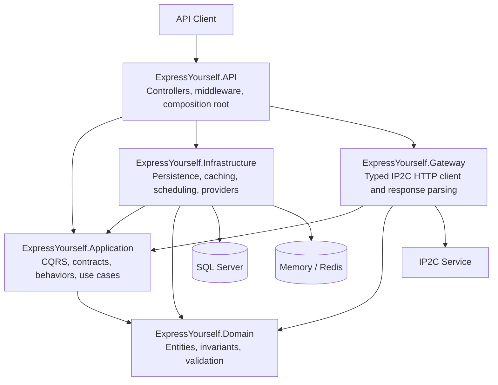

# ExpressYourself


**ExpressYourself** is a .NET 10 REST API that resolves IPv4 addresses to country information through the public IP2C service.

The application follows a **cache → database → IP2C** lookup flow. Successful results are stored in SQL Server and cached for later requests. A Quartz job refreshes stored addresses every hour, while a reporting endpoint returns the number of IP addresses per country and their latest update time.

## Main Features

- IPv4-to-country lookup
- Memory or Redis caching
- SQL Server persistence
- Hourly background refresh
- Country report with optional filtering
- CQRS with MediatR
- Retry, timeout, and circuit breaker for IP2C
- Rate limiting, health checks, and `ProblemDetails`
- Unit and integration test coverage, enforced by CI on every pull request

## Architecture



| Project | Responsibility |
|---|---|
| `ExpressYourself.Domain` | Entities, statuses, validation, and domain rules |
| `ExpressYourself.Application` | CQRS queries/commands, contracts, interfaces, and behaviors |
| `ExpressYourself.Infrastructure` | EF Core, Dapper, repositories, caching, and Quartz |
| `ExpressYourself.Gateway` | Typed HTTP client and IP2C response parsing |
| `ExpressYourself.API` | Controllers, middleware, configuration, and health checks |
| `ExpressYourself.Tests` | Unit, persistence, infrastructure, and integration tests |

The implementation uses Clean Architecture principles, Autofac dependency injection, Repository and Unit of Work patterns, MediatR pipeline behaviors, and a decorator-style provider chain.

## Lookup Flow

For every IP request, the application checks:

1. Cache
2. SQL Server
3. IP2C

```text
CachedIpInformationProvider
    -> DatabaseIpInformationProvider
        -> Ip2cIpInformationProvider
```

When data is returned by IP2C, it is persisted and cached. Unknown IP results use a shorter cache lifetime. Concurrent requests for the same address are synchronized to avoid duplicate database and external-service calls.

## Domain Model

### Country

```text
TwoLetterCode
ThreeLetterCode
CountryName
```

Country codes are validated and normalized to uppercase.

### IpAddress

```text
Address
CountryTwoLetterCode
Status
LastCheckedAtUtc
LastUpdatedAtUtc
RowVersion
```

The current implementation supports **IPv4 only**. `LastCheckedAtUtc` records the latest verification, while `LastUpdatedAtUtc` changes only when the stored information changes.

## Technology Stack

| Area | Technology |
|---|---|
| Runtime | .NET 10 / C# |
| API | ASP.NET Core Web API |
| Persistence | EF Core, SQL Server, Dapper |
| Cache | IMemoryCache or Redis |
| CQRS | MediatR |
| Dependency Injection | Autofac |
| Scheduling | Quartz.NET |
| Resilience | Microsoft HTTP Resilience / Polly |
| Documentation | Swagger / OpenAPI |
| Testing | xUnit |

## Getting Started

### Requirements

- .NET 10 SDK
- SQL Server
- Redis only when Redis caching is enabled
- `dotnet-ef` for migrations

### Setup

```bash
git clone https://github.com/Mpooks/ExpressYourself.git
cd ExpressYourself
dotnet restore ExpressYourself.slnx
```

Configure the SQL Server connection in `ExpressYourself.API/appsettings.json` or with user secrets:

```bash
dotnet user-secrets --project ExpressYourself.API set \
  "ConnectionStrings:SqlServer" \
  "Server=localhost;Database=ExpressYourself;Integrated Security=true;TrustServerCertificate=true;"
```

Apply migrations:

```bash
dotnet ef database update \
  --project ExpressYourself.Infrastructure \
  --startup-project ExpressYourself.API
```

Run the API:

```bash
dotnet run --project ExpressYourself.API
```

Development URLs:

- Swagger: `https://localhost:7148/swagger`
- HTTP: `http://localhost:5158`

## Configuration

Main settings are stored in `ExpressYourself.API/appsettings.json`.

```json
{
  "ConnectionStrings": {
    "SqlServer": "<sql-server-connection>",
    "Redis": ""
  },
  "Cache": {
    "Provider": "Memory",
    "DefaultTtlMinutes": 60,
    "NegativeTtlSeconds": 60
  },
  "RefreshJob": {
    "Enabled": true,
    "CronExpression": "0 0 * * * ?",
    "BatchSize": 100,
    "MaxConcurrency": 4
  }
}
```

Set `Cache:Provider` to `Redis` and provide `ConnectionStrings:Redis` to enable distributed caching. When Redis is temporarily unavailable, the application falls back to memory cache.

## API Endpoints

### IP Information

```http
GET /api/ips/{address}
```

Example:

```http
GET /api/ips/8.8.8.8
```

```json
{
  "ipAddress": "8.8.8.8",
  "twoLetterCountryCode": "US",
  "threeLetterCountryCode": "USA",
  "countryName": "United States"
}
```

Possible responses: `200`, `400`, `404`, `429`, `502`, and `503`.

### Country Report

```http
GET /api/reports/countries
GET /api/reports/countries?codes=GR&codes=IT
```

```json
[
  {
    "countryName": "Greece",
    "addressesCount": 4,
    "lastAddressUpdated": "2026-07-24T10:30:00+00:00"
  }
]
```

The endpoint accepts up to 50 two-letter country codes.

### Manual Refresh

Available only in Development:

```http
POST /api/admin/refresh
```

```json
{
  "scanned": 100,
  "changed": 8,
  "unchanged": 90,
  "failed": 2
}
```

### Health Checks

```http
GET /health/live
GET /health/ready
```

Readiness checks SQL Server and Redis when Redis is enabled.

## Scheduled Refresh

Quartz executes the refresh job every hour by default. The job reads stored addresses in batches, calls IP2C with limited concurrency, updates changed records, and invalidates their cache entries. Overlapping executions are prevented, and a failure for one IP does not stop the entire operation.

## Reliability and Protection

The API includes:

- Exponential retry with jitter
- Configurable timeout and circuit breaker
- IP2C response validation
- Standardized `ProblemDetails` errors
- Correlation and trace logging
- MediatR validation, logging, and performance behaviors
- Fixed-window rate limiting
- Startup configuration validation
- 64 KB maximum request-body size

## Testing

Run all tests:

```bash
dotnet test ExpressYourself.slnx
```

The test suite covers domain validation, CQRS handlers, IP2C parsing, caching, Redis fallback, repositories, database constraints, scheduled refresh, API endpoints, health checks, rate limiting, graceful degradation, and cache-stampede protection.

## Design Decisions

- **Cache first** reduces latency and repeated work.
- **Database second** allows reuse of previously resolved IPs.
- **IP2C last** limits external requests and dependency cost.
- **EF Core and Dapper** separate transactional persistence from efficient reporting queries.
- **Memory and Redis support** allows both simple local execution and distributed deployment.
- **Separate checked and updated timestamps** distinguish routine verification from real data changes.
- **Development-only manual refresh** supports testing without exposing an administrative production endpoint.

---

ExpressYourself demonstrates a maintainable approach to external API integration, caching, persistence, scheduled processing, testing, and operational reliability in ASP.NET Core.
